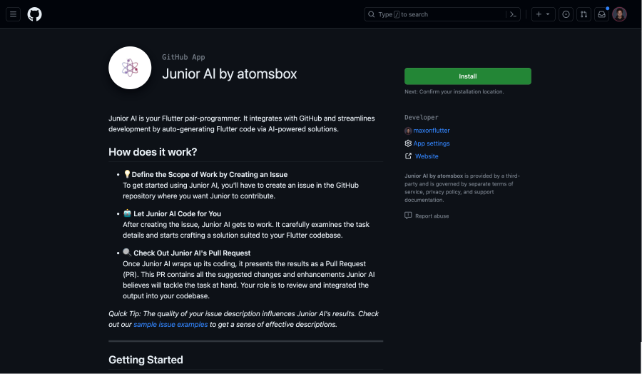
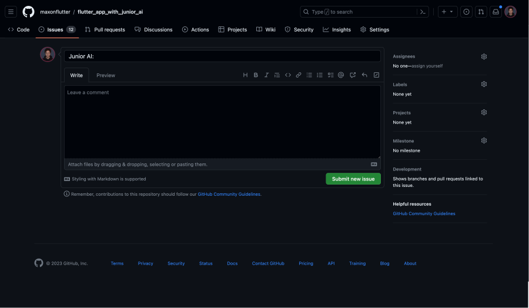
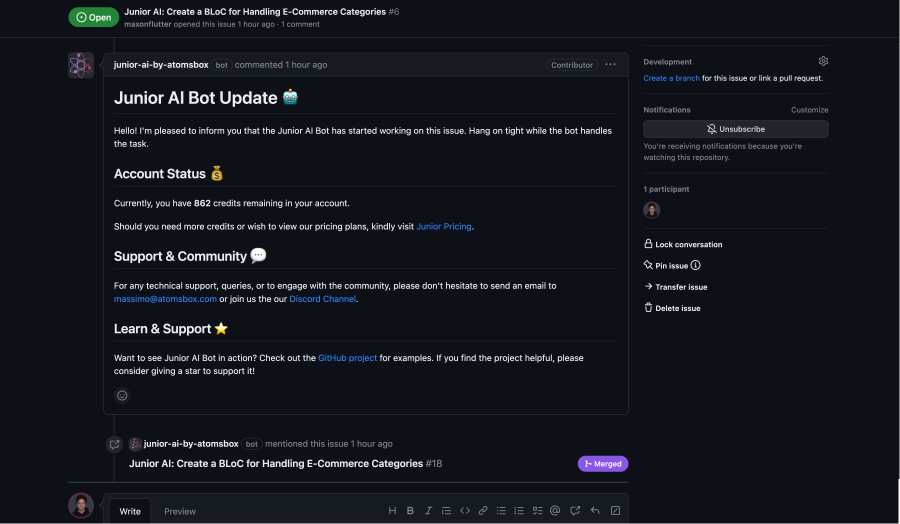
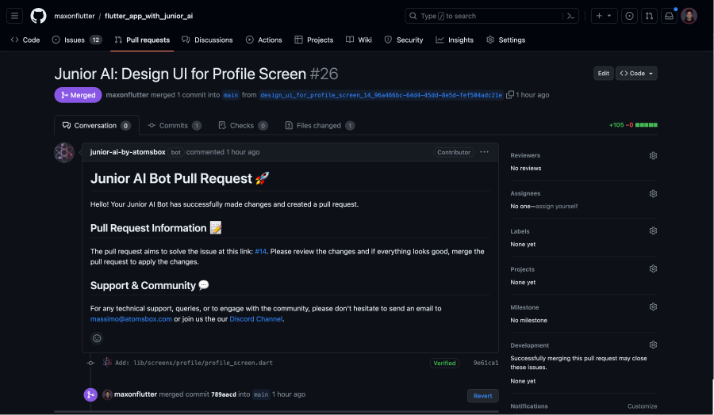

# Junior AI: Build Apps Faster

  

junior is your Flutter pair-programmer. It integrates with GitHub and streamlines development by auto-generating Flutter code via AI-powered solutions.

**Learn more at [junior.atomsbox.com](https://junior.atomsbox.com)!**

---

## Getting Started with Junior AI
Welcome to Junior AI! Here's a step-by-step guide to help you get started.

### Step 1: Connect Junior AI to Your GitHub Repository
To use Junior AI in your Flutter projects, the first step is to establish a connection between Junior AI and your GitHub repository. This connection enables Junior AI with the permissions it requires to edit and contribute to your project codebase.

**How to Connect:**
1. **Start on GitHub:** Log in into your GitHub account, and head over to the **Junior AI GitHub App page**. 
   
2. **Initiate the Integration:** Once on the app page, find the '**Install**' or '**Add to Repository**' button, and click on it to get started.

3. **Select Your Repository:** A list showcasing all your repositories will pop up. From this list, cherry-pick the repository or repositories you allow Junior AI to work and create code for.

4. **Go to [junior.atomsbox.com](https://junior.atomsbox.com):** After selecting the repository, you'll be redirected to [junior.atomsbox.com](https://junior.atomsbox.com). If you haven't already, you will need to create an account here.

5. **Link Your GitHub:** Once logged in or signed up, you'll be prompted to register your GitHub account. It's a simple process — just input your GitHub username. This step ensures that Junior AI recognizes and interacts with your chosen repositories.

🎉 **Voila!** Once you've navigated these steps, Junior AI is ready to contribute to your GitHub repository!

## Step 2: Define the Scope of Work by Creating an Issue

To get started using Junior AI, you'll have to create an issue in the GitHub repository where you want Junior to contribute. For the best results with Junior AI, it's crucial to outline your task clearly in a GitHub issue. This helps Junior AI understand exactly what you need.

### How to Create an Issue:
1. **Go to Issues:** Head to the '**Issues**' tab in your chosen repository.
2. **Start a Task:** Press the '**New Issue**' button.
3. **Title it Right:** Start your title with "**Junior AI:**", followed by a brief description. This step is vital. Without this prefix, Junior won't pick up on the issue, and no code will be generated.
4. **Detail the Description:** Use the description to clearly express your needs. Include relevant information, context, or resources. The clearer you are, the better Junior AI can meet your needs.

💡 **Quick Tip:** The quality of your issue description influences Junior AI's results. Check out our [sample issue examples](#) to get a sense of effective descriptions.

In essence, clarity leads to precision. The more detailed you are, the better Junior AI can assist you.

## Step 3: Let Junior AI Code for You
After creating the issue, Junior AI gets to work. It carefully examines the task details and starts crafting a solution suited to your Flutter codebase.

### What Happens Next:
1. **Quick Update & Notification**: As soon as Junior AI starts, it updates the issue. It creates a new branch just for this task. Once coding is done, the code gets added to this branch, and a Pull Request (PR) is started. To keep you informed, Junior sends an email notification after this step.
2. **Behind the Scenes with OpenAI**: Junior's skill isn't just its own doing. It uses the OpenAI API to understand your input and generate the right code. This method is tailored using Flutter-focused guidelines and takes insights from a curated Flutter code library. This collaboration ensures the final output is both precise and top-notch.

## Step 4: Check Out Junior AI's Pull Request
Once Junior AI wraps up its coding, it presents the results as a Pull Request (PR). This PR contains all the suggested changes and enhancements Junior AI believes will tackle the task at hand.

### Reviewing and Merging the PR:
1. **Find the PR:** Head to the '**Pull Requests**' section in your GitHub repo.
2. **Spot Junior's PR:** Look for the PR from Junior AI. It'll be clearly labeled for easy recognition.
3. **Review the Adjustments:** Dive into the PR to see the changes made to the Flutter code. Carefully evaluate each modification to ensure it matches your project's standards and your vision.
4. **Merge if Satisfied:** If the new code fits the bill, go ahead and merge the PR, incorporating Junior's work into your main codebase.

### Key Points:

- **Junior's Reach:** Understand that Junior might not fully grasp every aspect of your repository's code. This could mean a few tweaks on your part after accepting a PR from Junior.
  
- **Junior's Role:** Junior AI is great at churning out initial code drafts and taking care of repetitive tasks, but it isn't a developer replacement. Consider Junior a trusty sidekick, there to streamline your process, but always go through PRs attentively to ensure the final code aligns with your project goals.

